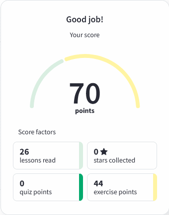

# **rsschool-cv**

# **_Yury Kanischeuski_**

## **_Contact information:_**

**Phone:** +375298342565

**E-mail:** yury.kanisheuski@gmail.com

**Telegram:** @Yruy83

**Disord:** Yruy83(@Yruy83)

---

## **_About Me_**

I am 39 years old. I work as a foreman of electrical fitters for repair and maintenance of electrical equipment.My tasks in work are to ensure the operation of the lines of the enterprise and to preserve the health and life of my people, so that at the end of the working day everyone leaves alive and well.My life statement is "non progredi est regredi".That is why I'm here.

---

## **_Skils_**

- no skils yet, but I'm working in this direction.

---

## **_Code example_**

```
<!DOCTYPE html>
<html lang="ru">
<head>
	<meta charset="UTF-8">
	<title>Первая верстка</title>
	<link rel="stylesheet" href="css/main.css">
</head>
<body>
	<header>
		
		<h1>Вступление H1</h1>
		<p class="new">
		Это текст моего первого домашнего задания.
		</p>
	</header>
```

---

## **_Courses_**

- HTML and CSS Tutorials on the w3schools (in progress).



## **_Languages_**

- _Ukrainian_ - Native.

- _Russian_ - professional level of proficiency.

- _English_ - pre-intermediate.
